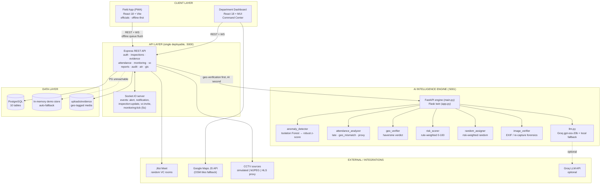
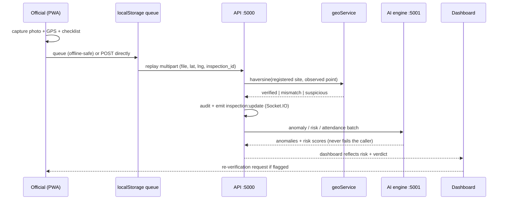
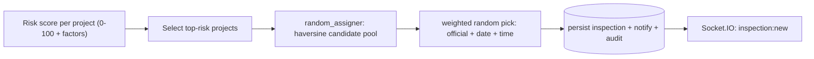

# Samaj Drishti — As-Built HLD & LLD (DoSJE · Problem Statement 26095)

**AI-Powered Real-Time Monitoring & Random Inspection System for Transparent Governance**

> This document describes what is **actually implemented and verified in this
> repository** — not an aspirational target architecture. Where the earlier
> "blueprint" (Kong, Kafka, InfluxDB, MinIO, YOLOv8 edge, WatermelonDB, Next.js,
> UX4G) is *not* built yet, it is listed honestly in
> [§3 Blueprint vs As-Built](#3-blueprint-vs-as-built--honest-gap-map) and
> [§5 Roadmap](#5-roadmap-scale-phase) rather than presented as working code.
>
> **How to use this doc for slides:** every diagram is Mermaid. Paste a block into
> <https://mermaid.live>, click *Download as PNG* (or *Copy as SVG*), drop it into
> Canva / Figma / PowerPoint, then apply the government-blue theme
> (`#1a5276`, `#2e86c1`, `#27ae60`, `#8e44ad`, `#e67e22`) on top.

---

## 1. High-Level Design (HLD)

### 1.1 The system in one paragraph

Samaj Drishti closes the loop between a **field inspector on a phone with no
network** and a **department command centre at a desk**. Officials run an
installable PWA that captures geo-tagged evidence, checklists, attendance punches
and surprise video checks, queueing everything locally while offline. A single
REST + Socket.IO API ingests those submissions, runs deterministic
geo-verification (haversine against registered site coordinates), and calls a
Python AI engine for anomaly detection, risk scoring, attendance irregularity
analysis and randomised risk-weighted inspection assignment. The back-office
dashboard consumes the same API: a real GIS map of every monitored centre with
its head, a ground-level live CCTV wall, random Jitsi video verification rooms,
AI insights, audit trail and digital ATR adjudication. Every state change is
recorded in an append-only audit log.

### 1.2 System architecture (as-built)



**Read it as:** clients → **one** API process (REST *and* realtime share port
5000) → **one** AI engine process → one database. There is no message broker and
no microservice fleet in the shipped build; the boundaries below are logical
modules inside two processes, which is deliberate for a 24-hour hackathon and
still keeps a clean seam for later extraction.

### 1.3 Runtime topology & ports

| Port | Process | Command | Notes |
|---|---|---|---|
| 5000 | API (Node 18 + Express) | `cd backend && npm run dev` | REST **and** Socket.IO; PostgreSQL when reachable, else in-memory demo mode |
| 5001 | AI engine (Python 3.13) | `cd ai-engine && .venv\Scripts\python.exe app.py` | FastAPI `main:app` is the tested entrypoint; Flask `app.py` is the legacy twin |
| 5173 | Department dashboard (canonical) | `cd admin && npm run dev` | Vite + React + MUI; **currently running on 5176** (5173 is held by another project) |
| 5174 | Field app PWA (canonical) | `cd mobile-web && npm run dev` | **currently running on 5175** (5174 held by another project) |
| 5001→ | Spring Boot twin API | `cd backend-java && mvn spring-boot:run` | Same JSON contract, contract tests + PowerShell smoke suites |
| — | Legacy React Native app | `mobile/` | No Android SDK/JDK on this machine; the PWA is the demo path |

```
officials' phones ──┐
                   ├─►  API :5000  ──►  AI engine :5001  ──►  Groq (optional)
command centre ─────┘      │  │
                          │  └─ socket.io rooms: user_<id>, broadcast
                          ├─► PostgreSQL (or in-memory demo store)
                          └─► uploads/evidence (geo-tagged media)

dashboard :5173/:5176 ─┐
field PWA :5174/:5175 ─┴─► REST + WebSocket ─► :5000
```

### 1.4 Component inventory

| # | Component | Path | Responsibility | Stack |
|---|---|---|---|---|
| 1 | **Field app (PWA)** | `mobile-web/` | Offline inspection runs: checklist, GPS verify, evidence, live VC, attendance, AI view | React 18, Vite 4, react-router 6, axios, socket.io-client, service worker |
| 2 | **Department dashboard** | `admin/` | Command centre: KPIs, GIS map, CCTV wall, AI insights, ATRs, reports, audit, users | React 18, Vite 4, MUI 5, Leaflet 1.9 (fallback), Google Maps JS |
| 3 | **API server** | `backend/src/` | REST + realtime, auth, geo-verification, AI orchestration, CCTV proxy, audit | Node 18, Express 4, Socket.IO 4, multer, jsonwebtoken, bcryptjs, pg, helmet, node-cache |
| 4 | **AI engine** | `ai-engine/` | Anomaly, risk, attendance, geo, random assignment, image forensics, LLM narrative | Python 3.13, FastAPI + Flask twin, NumPy, scikit-learn (guarded), pandas (guarded), Pillow, OpenCV (optional) |
| 5 | **Java API twin** | `backend-java/` | Same contract in Spring Boot 17 (web, JPA, security) for team portability | Spring Boot 17, JUnit 5, MockMvc, PowerShell smoke suites |
| 6 | **Data layer** | `backend/src/config/` | PostgreSQL schema bootstrap, or deterministic in-memory demo store | `pg` + custom memory store (SQL-substring router) |
| 7 | **Legacy mobile** | `mobile/` | React Native source, syntax-validated; upload contract exercised | React Native (no toolchain on this machine) |
| 8 | **Verification assets** | `scripts/`, `backend/_verify.mjs`, `ai-engine/tests/`, `backend-java/*smoke-*.ps1` | e2e sweep, Jest contract check, 25 pytest cases, 5 Java smoke suites | node, jest, pytest, PowerShell |

### 1.5 The four flows that matter in a demo

**A. Field capture → geo-verification → AI (the closed loop)**



The `suspicious` verdict auto-escalates an inspection to `flagged` and raises an
alert — this is the "reduce fake reporting / proxy functioning" requirement, and
it is deterministic (no AI in the loop), so it can be demonstrated offline.

**B. Risk-weighted random assignment**



**C. GIS centre drill-down (map → head → ground CCTV)**

```
GET /api/gis/centers
  -> { map: { provider: "google", api_key }, centers: [...] }
        centre  = coordinates, scheme, sanction code, capacity vs verified
                 headcount, AEBAS punches, discrepancy delta, status
                 head   { name, designation, phone, email, since }
                 cameras[] { live snapshot_url, tamper_flag, occlusion_pct,
                             detected_headcount, aebas_punch_count, online }
  -> Google Maps pin        --hover-->  InfoWindow card
                               (Leaflet circleMarker + interactive tooltip
                                when the Google key is unavailable)
        department badge · centre name · CURRENT HEAD
        [ Call (tel:) ] [ Video call (Jitsi room created via API) ]
     --click-->  side panel: compliance grid + GROUND-LEVEL CCTV · LIVE grid
        snapshots re-fetched every 4 s, LIVE/OFFLINE + tamper chips,
        AI headcount vs AEBAS punches, flagged-centre audit alert
```

**D. Surprise video verification**

```
POST /api/vc/sessions { project_id, mode: "direct" }
  -> random pairing of project + PMU official (cannot be pre-arranged)
  -> vc_sessions row (room_id, join_url, status = "live")
  -> audit("vc.session_opened") + notification
     + socket.io "vc:invite" (to the official's room) + "alert" (broadcast)
  -> join_url = https://meet.jit.si/SamajDrishti-XXXXXX  (VC_BASE_URL env)
  -> presence log per participant via POST /vc/sessions/:id/join-log
```

### 1.6 Non-functional requirements — what the build actually does

| NFR | Implementation in this repo | Evidence |
|---|---|---|
| **Offline-first field work** | Service worker + web manifest (installable PWA); `localStorage` op-queues `sd_offline_evidence` / `sd_offline_inspections`; only successfully synced items are dequeued | `mobile-web/src/services/offlineQueue.js`, `public/sw.js` |
| **Low-connectivity tolerance** | Every AI call wrapped with a deterministic local fallback; dashboards degrade instead of failing | `aiService.js` catch branches, `ai-engine` local narrative |
| **Runs on locked-down machines** | Guarded imports: scikit-learn blocked → NumPy robust z-score + rule screening; a policy-blocked pandas build is swapped at the venv level instead of crashing the engine | `models/anomaly_detector.py` guard block; `/api/health` reports `anomaly_backend` |
| **Zero-setup demo** | PostgreSQL unreachable → deterministic in-memory dataset (10 projects, 29 inspections, 11 cameras, 14 days attendance, seeded anomalies) | `backend/src/config/db.js` `DB_MODE=auto` |
| **Realtime** | Socket.IO on the API's own port, JWT in the handshake, per-user rooms, 5 s `monitoring:tick` heartbeat | `backend/src/index.js` |
| **Auditability** | Append-only `audit` table written on every state change (assignment, geo verdicts, VC, camera status, ATR) | `auditService.js`, `GET /api/audit` |
| **Evidence integrity (built)** | SHA-256 taken on upload, each item linked to the previous hash of the same inspection; back-office verification **re-hashes the file** and refuses to sign off a mismatch (audit + realtime alert) | `evidenceController.js` `hashFile` / `checkIntegrity`, `scripts/integrity-check.mjs` |
| **Evidence integrity (legacy rows)** | Seeded demo rows predate the chain and honestly report `unverified` | `integrity_status` column |
| **Contract stability** | One contract doc, e2e sweep, Jest contract check, 25 pytest cases, 5 Java smoke suites | `docs/API-CONTRACT.md`, `scripts/e2e-check.mjs` |
| **Accessibility / GIGW** | Government branding, print/PDF report header, responsive MUI layout — **full GIGW 3.0 / WCAG 2.1 AA audit is roadmap** | `admin/src/pages/Reports.jsx` |

---

## 2. Low-Level Design (LLD)

### 2.1 API server — `backend/src/`

```
src/
├── index.js                  Express app + helmet + cors + Socket.IO + heartbeat
├── config/
│   ├── db.js                 pg Pool · DB_MODE=auto|postgres|memory · schema bootstrap
│   └── memoryStore.js        SQL-substring router + deterministic demo seed
├── middleware/auth.js        auth · softAuth (img ?token=) · roleCheck(...)
├── routes/                   auth projects inspections evidence notifications admin
│                             attendance monitoring vc reports audit atr beneficiaries gis
├── controllers/              one per route domain (+ gisController for the map feed)
└── services/
    ├── aiService.js          axios client to :5001, every call has a local fallback
    ├── geoService.js         distanceMeters · normaliseCoords · verify (haversine)
    ├── cctvService.js        renderFrame (server-side PNG) · proxySnapshot (HLS/MJPEG)
    └── auditService.js       record() · list() — append-only trail
```

**Request lifecycle**

```
request ─► helmet/cors/json ─► route ─► auth (JWT ─► users lookup ─► req.user)
                                                 │
                                                 ▼
                                          controller
                                             │
                      ┌──────────────────────┼──────────────────────┐
                      ▼                      ▼                      ▼
              geoService.verify()      auditService.record()   aiService.<call>()
              (haversine + verdict)   (append-only)           (axios ─► :5001)
                      │                      │                      │
                      └──────────────┬───────┴──────────────────────┘
                                     ▼
                        pool.query() ──► PostgreSQL
                                     └──► memoryStore router (demo mode)
                                     ▼
                        io.emit('inspection:update' | 'alert' | ...)
```

**Key design decisions**

* **One process, many modules.** No service registry: `aiService`, `geoService`,
  `cctvService`, `auditService` are plain modules with unit-testable functions.
  Extraction into microservices later is a port-mapping exercise, not a rewrite.
* **softAuth for `` sources.** CCTV snapshots and GIS tiles load via ``
  / `InfoWindow` content, which cannot send an `Authorization` header, so
  `?token=` is accepted on those two endpoints only.
* **Memory mode is a real adapter, not a mock.** `memoryStore.js` intercepts the
  same `pool.query()` calls by SQL prefix and answers from in-process collections,
  so controllers are identical in both modes; `DB_MODE=postgres` turns the
  fallback into a hard boot failure (deployment safety).
* **Uploads.** multer disk storage under `uploads/evidence/`, extension
  whitelist (jpg/jpeg/png/mp4/mov/pdf), 10 MB cap; geo arrives either as a
  `geo_coords` JSON field or as discrete `lat`/`lng` multipart fields (RN clients).

### 2.2 AI engine — `ai-engine/`

```
ai-engine/
├── main.py            FastAPI service (tested entrypoint, uvicorn main:app)
├── app.py             Flask twin with identical routes (legacy launcher)
├── schemas.py         Pydantic request/response models (fail fast at the edge)
├── llm.py             Groq (openai/gpt-oss-20b) + deterministic local fallback
└── models/
    ├── anomaly_detector.py     Isolation Forest → robust z-score → rule screening
    ├── attendance_analyzer.py  late_login · geo_mismatch · missing_punch
    │                           proxy_sign_in · low_attendance · overlong_session
    ├── geo_verifier.py         haversine verdict engine
    ├── risk_scorer.py          rule-weighted 0-100 + factors
    ├── random_assigner.py      risk-weighted random pairing (haversine pool)
    └── image_verifier.py       EXIF + re-capture forensics (Pillow/OpenCV)
```

**Engine endpoints** (`:5001`): `/api/health`, `/api/risk/score`,
`/api/risk/score-batch`, `/api/anomaly/detect`, `/api/attendance/analyze`,
`/api/patterns/suspicious`, `/api/geo/verify`, `/api/narrative`.

**Graceful-degradation ladder** (this is the demo's most defensible engineering story)

```
1. scikit-learn available  -> Isolation Forest + StandardScaler
2. blocked by policy/DLL   -> pure-NumPy robust modified z-score (MAD) + domain rules
3. batch < 8 rows          -> transparent rule-based screening (flagged / risk > 80)
4. LLM provider absent     -> deterministic local narrative
5. engine offline          -> API returns flat risk 50 / empty lists; dashboard
                              keeps working, "AI offline" badge shown
```

`/api/health` publishes `anomaly_backend` and `llm_provider`, and the dashboard
renders them — judges can see which rung the engine ran on, not a claim.

### 2.3 Data model

`config/db.js` bootstraps the schema with `CREATE TABLE IF NOT EXISTS`, so the
same build runs on a fresh database and on the in-memory demo store.

| Table | Purpose | Notable columns |
|---|---|---|
| `users` | accounts + roles | `role` (admin/supervisor/official/ngo/beneficiary), `department`, `phone` |
| `projects` | monitored centres | `geo_coords POINT`, `department` (scheme), `status`, `budget`; demo `metadata` JSONB holds sanction code, capacity, verified headcount, AEBAS punches, centre head |
| `inspections` | inspection runs | `project_id`, `assigned_to`, `status`, `ai_risk_score`, `scheduled_date`, `completed_date`, `notes` |
| `evidence` | geo-tagged media + **integrity chain** | `inspection_id`, `type`, `file_path`, `geo_coords POINT`, `timestamp`, `sha256_hash`, `previous_hash`, `file_size`, `mime_type`, `hash_verified`, `verified_at`, `integrity_status`, `verified` |
| `cameras` | CCTV inventory | `project_id`, `stream_type` (simulated/mjpeg/hls), `stream_url`, `geo_coords`, `status`, `last_seen` + AI flags (`tamper_flag`, `occlusion_pct`, `detected_headcount`) |
| `attendance` | geo-fenced punches | `official_id`, `project_id`, `check_in/out`, `geo_coords`, `device`, `mode` |
| `vc_sessions` | random verification rooms | `room_id`, `project_id`, `official_id`, `mode`, `status`, `join_url` |
| `vc_join_logs` | presence inside a room | `session_id`, `user_id`, `action` |
| `notifications` | in-app alerts | `user_id`, `message`, `type`, `read_status` |
| `audit` | append-only trail | `actor_id/name`, `action`, `entity`, `entity_id`, `meta`, `created_at` |

*Schema note:* `projects.metadata` is the JSONB blob that carries sanction data
and the centre head in demo mode. The `CREATE TABLE` in `db.js` predates that
field, so on a **real PostgreSQL** deployment add
`ALTER TABLE projects ADD COLUMN IF NOT EXISTS metadata JSONB;` — otherwise the
map falls back to "head not on file" (the UI already handles that).

### 2.4 Realtime contract (Socket.IO, same host/port as the API)

| Direction | Event | Payload | Emitted by |
|---|---|---|---|
| client → server | `join` | `userId` (joins room `user_<id>`) | `index.js` |
| server → client | `notification` | `{ message, type }` | notification controller |
| server → client | `inspection:new` | `{ inspection }` | assignment + AI assign |
| server → client | `inspection:update` | `{ inspection, status, flags }` | status changes (incl. geo flags) |
| server → client | `vc:invite` | `{ session }` | VC creation |
| server → client | `alert` | `{ severity, message, meta }` | geo failures, camera offline, AI anomalies |
| server → client | `monitoring:tick` | `{ online, offline, alerts, timestamp }` | 5 s heartbeat |

Clients: `mobile-web/src/services/realtime.jsx` and the dashboard's socket
client both connect with `io(BACKEND_ORIGIN, { auth: { token } })`.

### 2.5 Field app (PWA) — `mobile-web/src/`

```
screens/     Login Register Home Inspections InspectionDetail InspectionRun
             Checklist GpsVerify Evidence EvidenceCapture VideoCheck Monitoring
             Meet Attendance AiAnalytics Assignment Offline Alerts Profile
             Submit Summary
context/     AuthContext (session restore) · InspectionContext (run state)
services/    api.js (absolute http://<host>:5000, JWT interceptor, upload)
             geo.js · offlineQueue.js · realtime.jsx
public/      sw.js (offline shell) · manifest.webmanifest · icon.svg
```

**Offline queue semantics** (`offlineQueue.js`): evidence and inspection updates
are appended to `localStorage` queues with a `queued_at` timestamp; the flush
loop POSTs them, and **only successfully synced items are removed** — a partial
success never drops the rest of the queue (this was an explicit bug fix, see
README "Fixed" table). A badge in the UI shows pending counts.

**Geo-fencing:** every status change and evidence upload carries the device
position; the API re-verifies it server-side (the client cannot be trusted), and a
`suspicious` verdict auto-flags the inspection.

### 2.6 Department dashboard — `admin/src/`

```
pages/       Dashboard · GISMap · LiveMonitoring · Inspections · InspectionDetail
             Evidence · AIInsights · ATRAdjudication · Attendance · Reports
             Projects · Users · AuditLogs · Procedure · Settings · Login
components/  Sidebar (12 primary modules + footer links)
services/    api.js (axios + JWT interceptor + 401 → sign-out, monitoringAPI,
             vcAPI, gisAPI)
```

**GIS map engine** (the newest module): fetches `/api/gis/centers`, prefers the
Google Maps JS API with the backend-served key, and falls back to a lazily
imported Leaflet + OpenStreetMap map if the key is missing or rejected
(`gm_authFailure` also demotes at runtime). Markers are scheme-coloured circles;
hover opens a department + head card with call and video-call actions; click
loads the drill-down with the live CCTV wall.

**CCTV wall:** ``
refreshed on an interval — the server renders simulated frames or proxies
real HLS/MJPEG, so the browser never touches a third-party origin.

### 2.7 Security & trust model (as-built)

| Layer | Measure | Status |
|---|---|---|
| Passwords | bcryptjs (cost 8 in demo seed) | ✅ |
| Session | JWT bearer tokens, `JWT_SECRET` from `.env` | ✅ (no refresh-token rotation yet) |
| Authorisation | `roleCheck('admin','supervisor',…)` on mutating back-office routes | ✅ |
| Transport/headers | helmet (CSP-friendly defaults, `crossOriginResourcePolicy:false` for the dashboard), CORS open for the two frontends | ✅ dev-grade |
| Media paths | multer extension whitelist + 10 MB cap | ✅ |
| Evidence trust | geo-tag + server-side re-verification; **SHA-256 chain re-hashed on sign-off** (tamper -> audit + alert) | ✅ (`scripts/integrity-check.mjs`) |
| Audit | append-only `audit` rows on every state change | ✅ |
| Rate limiting / TLS / AES-at-rest / SQLCipher | — | 🔵 deployment-phase |

### 2.8 Verification assets (what we can prove on stage)

| Asset | Command | Covers |
|---|---|---|
| End-to-end sweep | `node scripts/e2e-check.mjs` | 82 checks across every PS-26095 feature, against the live API + engine |
| Evidence-integrity proof | `node scripts/integrity-check.mjs` | 20 checks: hash-on-upload, chain links, re-hash verification, on-disk tamper detection, refusal to sign off, audit entry, repair |
| Contract check | `node backend/_verify.mjs` | Health, auth, data mode, AI status assertions |
| Engine unit tests | `.venv\Scripts\python.exe -m pytest ai-engine/tests -q` | 25 cases: every endpoint, degradation when the LLM is unavailable |
| Java smoke suites | `backend-java/smoke-all.ps1` | Auth/projects, inspections, modules, AI integration (requires JDK) |
| Frontend builds | `vite build` in `admin/` and `mobile-web/` | Production compile (12.3k / 144 modules) |

---

## 3. Blueprint vs As-Built — honest gap map

The circulated blueprint proposes a much heavier stack. For a SIH defence, the
winning move is to **present the as-built system and name the scale-up plan as
future work** — judges reward honesty plus a credible roadmap, and every ❌ below
is a "designed, not yet built" item, not a broken feature.

| Blueprint component | As-built status | What exists today |
|---|---|---|
| Express/FastAPI API | ✅ **built (better)** | Express + Socket.IO on one port; a Spring Boot twin of the same contract |
| PostgreSQL | ✅ built | Real schema; in-memory demo store as a deterministic fallback |
| Redis cache / session store | ❌ not needed | node-cache + JWT; no external Redis in the demo |
| Kafka / Celery queue | ❌ absent | Not required at this scale; in-process async + Socket.IO |
| InfluxDB time-series | ❌ absent | Attendance/CCTV metadata live in Postgres; fine for 1,300 institutions |
| MinIO / S3 evidence store | 🟡 local disk | `uploads/evidence/` with multer; swap for MinIO is config-only |
| Kong gateway | ❌ absent | Express middleware chain; Kong is a deployment-phase concern |
| YOLOv8 edge CCTV | 🔵 roadmap | Cameras expose `stream_type`; server renders/proxies frames; AI headcount + tamper flags are seeded/derived, not computed from pixels |
| WatermelonDB op-log | 🟡 simpler | `localStorage` queue with the same replay semantics (partial-success safe); no reactive DB |
| Next.js SSR dashboard | 🟡 Vite SPA | Vite + React 18 SPA (faster to build for the demo) |
| UX4G / GIGW 3.0 components | 🟡 partial | Government branding + print header; full GIGW/WCAG audit is roadmap |
| LLM (Gemma/Ollama) | ✅ **built (live)** | Groq `gpt-oss-20b` with a deterministic local fallback |
| Isolation Forest | ✅ **built (with fallback)** | Isolation Forest when importable, else NumPy robust z-score |
| SHA-256 evidence chain | ✅ **built & proven** | Hash on upload + `previous_hash` link, re-hash on verification, `tampered` verdict raises an audit entry and a realtime alert — 20/20 checks in `scripts/integrity-check.mjs` |
| FCM push | 🔵 roadmap | In-app notifications + Socket.IO realtime today |
| Docker Compose | 🔵 roadmap | `start-all.cmd` / `stop-all.cmd` on bare Node/Python today |
| Geofence radius 100 m | ✅ 250 m | `geoService.DEFAULT_RADIUS_M = 250`; per-call override supported |
| Assignment-log table | 🟡 audit table | `audit` rows record every assignment; a dedicated table is cleaner at scale |

### 3.1 Seven-minute demo script (every beat is a live feature)

| Time | Action | Screen / endpoint | Feature proved |
|---|---|---|---|
| 0:00 | Sign in with one tap | Dashboard | Role-based access, session restore |
| 0:30 | KPIs + AI risk mix | `/dashboard` | Real risk scores (avg 43, 5 low / 3 medium) |
| 1:00 | Open GIS map, hover a pin | `/gis-map` | Real Google map, centre head card |
| 1:30 | Click the pin → drill-down | `/gis-map` | Head card + GROUND-LEVEL CCTV LIVE (4 s refresh) |
| 2:00 | Flagged centre (Chaubisee) | `/gis-map` | Red pin, audit spotlight, 84.5 % lens obstruction |
| 2:30 | Start a video call from the pin | Jitsi room | Random VC pairing + room id + presence log |
| 3:00 | Open AI Insights | `/ai-insights` | Anomalies + risk factors + LLM briefing (live Groq) |
| 4:00 | Field app: offline capture | Field PWA | Geo-tagged evidence, offline queue badge |
| 4:45 | Back office: status change with far GPS | Inspections | Haversine verdict → auto-flag + alert |
| 5:00 | Tamper-Evidence Vault → "Re-check integrity" | `/evidence` | Live SHA-256 re-hash: `INTEGRITY OK` (or `TAMPERED` after a file is edited) |
| 5:30 | Attendance anomalies | `/attendance` | late_login / geo_mismatch / proxy_sign_in |
| 6:00 | Audit trail + ATR | `/audit-logs`, `/atr` | Append-only trail (incl. `evidence.integrity_failed`), adjudication workflow |
| 6:30 | Q&A | — | Degradation ladder + gap map as answers |

---

## 4. Design decisions worth defending

1. **Geo-verification before AI.** Distance maths is deterministic and cheap, so
   a proxy report is caught even when the engine is offline. AI enriches
   (risk, briefing); it never gates integrity.
2. **Degrade, never fail.** Every AI call, the map, the LLM, the database — all
   have a fallback. Judges can unplug the engine mid-demo and the system keeps
   working (the dashboard shows `aiOnline: false` honestly).
3. **One contract, three runtimes.** Node, Spring Boot and the Python engine
   implement the same JSON contract, verified by four independent test suites.
4. **Randomness is auditable.** Assignments and VC pairings are random *by
   design* (anti-collusion) but every draw is written to the audit trail.
5. **The map is a first-class citizen.** Real coordinates, real key served from
   the backend, and a drill-down that ends at the two things a department
   actually needs: *who runs this centre* and *what the cameras see right now*.

---

## 5. Roadmap (scale phase)

| Phase | Deliverable | Effort |
|---|---|---|
| ~~P1 — Evidence integrity~~ | ~~SHA-256 on upload, chain verification on read, "INTEGRITY OK/TAMPERED" badge~~ — **shipped** | done ✅ |
| P2 — Real CCTV | Register ONVIF/RTSP cameras; optional YOLOv8 headcount on an edge box per centre cluster | 2–3 days |
| P3 — Push | FCM for background officials; SMS fallback for no-internet centres | 1 day |
| P4 — Scale-out | MinIO for media, Redis for cache/sessions, rate limiting, TLS, Docker Compose | 1 day |
| P5 — Reach | Hindi/English i18n, WCAG 2.1 AA audit | 1–2 days |
| P6 — Hash anchoring | Publish a daily Merkle root / signed digest of the day's chain so tampering is provable even against the database itself | 1 day |

---

*Related docs: [API contract](API-CONTRACT.md) · [architecture diagrams](diagrams.html) ·
project [README](../README.md) · prototype plan (`../../prototype-plan.md`, workspace root).
Diagram blocks in this file are Mermaid — render at <https://mermaid.live> and export SVG for
print-quality slides.*


*Next: [§2 Low-Level Design](#2-low-level-design-lld) · [§3 Gap map](#3-blueprint-vs-as-built--honest-gap-map)*

